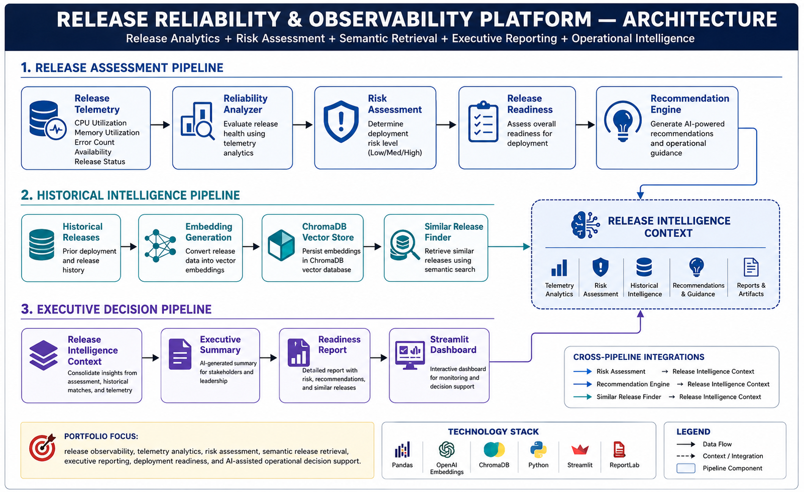

# Release Reliability & Observability Platform

## Overview

Release Reliability & Observability Platform is an enterprise-style AI-assisted operational intelligence system designed to analyze release telemetry, assess deployment risk, generate recommendations, perform semantic similarity search, and provide executive-level release insights.

The platform demonstrates observability analytics, vector search, operational intelligence, risk assessment, reporting, and dashboard visualization.

---

## Key Features

### Release Telemetry Analysis

* CPU utilization analysis
* Memory utilization analysis
* Error count tracking
* Availability monitoring
* Release status tracking

### Risk Assessment

* LOW risk classification
* MEDIUM risk classification
* HIGH risk classification
* CRITICAL risk classification

### Recommendation Engine

* Proceed with release
* Proceed with enhanced monitoring
* Review before deployment
* Block release and investigate

### Semantic Search

* Embedding generation
* ChromaDB vector storage
* Similar release retrieval
* Historical release matching

### Reporting

* Release Readiness Report
* Executive Release Summary
* Report export capability

### Dashboard

* Release KPIs
* Risk Distribution
* Executive Summary
* Release Recommendations
* Report Downloads

---

## Architecture Diagram



---

## Technology Stack

* Python
* Pandas
* ChromaDB
* Streamlit
* Vector Embeddings

---

## Generated Reports

* release_readiness_report.txt
* executive_release_summary.txt

---

## Dashboard Capabilities

### Release Metrics

* Total Releases
* Successful Releases
* Failed Releases
* Incident Releases

### Risk Distribution

* LOW
* MEDIUM
* HIGH
* CRITICAL

### Executive View

* Overall Release Health
* Release Statistics

### Operational Intelligence

* Risk Classification
* Release Recommendations
* Historical Similarity Search

---

## Installation

```bash
python -m venv venv
venv\Scripts\activate
pip install -r requirements.txt
```

## Run Dashboard

```bash
streamlit run app\dashboard.py
```

---

## Sample Dashboard Features

* Release Reliability Dashboard
* Risk Distribution Analytics
* Executive Release Summary
* Recommendation Engine
* Report Downloads
* ChromaDB Semantic Search
* Historical Release Matching

---

## Project Structure

```text
release-reliability-observability-platform/

├── app/
├── architecture/
├── data/
├── reports/
├── screenshots/
├── requirements.txt
└── README.md
```

---

## Project Status

Advanced AI MVP Complete

Version: v1.0

---

## Author

Lokesh Kumar

AI Infrastructure | RAG | Agentic Systems | Observability Engineering
